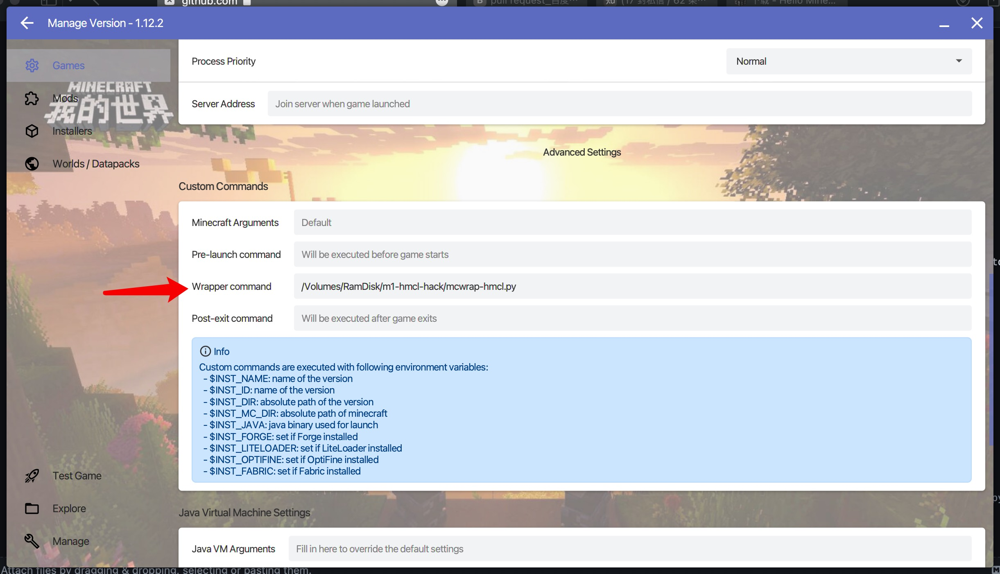
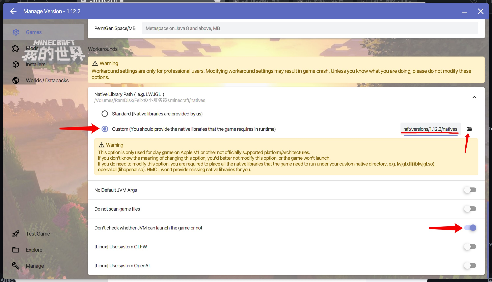

# m1-multimc-hmcl-hack

Want to get Minecraft running natively on a Mac with an M1 "Apple Silicon" chip? Thanks to [the excellent work](https://gist.github.com/tanmayb123/d55b16c493326945385e815453de411a) by [Tanmay Bakshi](https://gist.github.com/tanmayb123), it's possible!

This repo contains a wrapper script to be used with [MultiMC](https://multimc.org) or [HMCL](https://hmcl.huangyuhui.net) that will configure any MultiMC instance or HMCL game versions to use the Apple Silicon native libraries from Tanmay's work. All you have to do is set the wrapper command and make sure you're using an M1-compatible JDK, and it should just work. This fork should automatically be compatible with all versions of Minecraft and is compatible with Forge based modpacks as long as you use Java 8 instead of 11.

## Setup and Usage

### Pre-requisites

First, install the [Zulu Java 8 JRE for macOS ARM64](https://cdn.azul.com/zulu/bin/zulu8.52.0.23-ca-jre8.0.282-macosx_aarch64.dmg).

Then download and install [MultiMC](https://multimc.org/) or [HMCL](https://hmcl.huangyuhui.net).
### Clone this repo

Open a terminal (it's in the `Utilities` folder inside of `Applications`, if you're new to command line stuff).

To make it easy to follow along, we'll make a new directory called `Minecraft` in our home folder. If you'd rather put this repo somewhere else, that's fine - the location doesn't really matter. If you do put it somewhere else, remember to change the references to it in the commands below.

The lines beginning with `#` below are comments and don't need to be entered, but it's fine to copy paste them in along with the rest.

```shell
# Make a place to put our wrapper script and libraries
mkdir -p ~/Minecraft

# enter the new directory
cd ~/Minecraft

# clone this repo
git clone https://github.com/17hoehbr/m1-multimc-hack.git
```

### Configure MultiMC

Go to Settings, then navigate to the Java tab on the right. Then hit "Auto-detect".


It should open a window with a list of Java versions. Find the one that says "zulu-8" in the path and select it, then hit OK. (You may need to resize the window to see the full path.)


Still in the Settings pane, switch to the "Custom Commands" tab. In the "Wrapper Command" box, enter the full path to the `mcwrap.py` script from this repo, e.g. `/Users/your-username/stuff/m1-multimc-hack/mcwrap.py`.


An easy way to get the full path (assuming you put this repo in `~/Minecraft`) is to open a terminal and enter:

```shell
ls ~/Minecraft/m1-multimc-hack/mcwrap.py | pbcopy
```

This will expand the `~` character to the full path to your home directory (e.g. `/Users/yourname`), and copy the whole thing onto your clipboard using the `pbcopy` command. Now you can paste it into the "Wrapper Command" box.

That's it! You should be able to launch the instance and run with native performance.

### Configure HMCL

**Currently only passed the test on older Minecraft versions that uses LWJGL 2.x (Under 1.12.2), 3.x cannot run on macOS12.1. (Seems it will work on macOS11, on 12 it says that failed to load 'libglfw.dylib', maybe a re-compile for LWJGL is needed on macOS 12.).**

1.Click 'All versions', click 'Install a new game' to install game versions that you want to lauch if you haven't yet.

2.At 'All versions', then select the version you want to launch.

3.Back to main page, click the version dispalyed on the left side.

4.Check 'Enable specialized settings for this game'

5.Change Java Directory to proper (1.8.0_xxx (ARM64)) version


6.In Custom Commands section, change wrapper command to the absolute path to file 'mcwrap-hmcl.py'



An easy way to get the full path (assuming you put this repo in `~/Minecraft`) is to open a terminal and enter:

```shell
ls ~/Minecraft/m1-multimc-hack/mcwrap.py | pbcopy
```

This will expand the `~` character to the full path to your home directory (e.g. `/Users/yourname`), and copy the whole thing onto your clipboard using the `pbcopy` command. Now you can paste it into the "Wrapper Command" box.

7.Click 'Test game' at left bottom of HMCL

8.If game fails to start, change 'Native Library Path (e.g. LWJGL)' in Workarounds setction to /.../.minecraft/versions/[yourGameVersion]/natives (if there is no 'natives' folder in that directory, create one.), then enable 'Don't check whether JVM can launch the game or not'



9.Back to main page, click 'play' and enjoy!

## Support, etc

I did none of the work here except for stitching files from a few competing forks together.

The files `lwjglfat.jar` and all libraries in the `lwjglnatives` folder were compiled by Tanmay from the source available at https://www.lwjgl.org/source and are subject to its [BSD-style license terms](https://github.com/LWJGL/lwjgl3/blob/master/LICENSE.md).

The `mcwrap.py` script was written by Yusef Napora, and is public domain. Please feel free to fork and improve, but expect PRs & issues, etc to be routed to the Sirius Cybernetics Corporation, Complaints Division. [Share and Enjoy!](https://hitchhikers.fandom.com/wiki/Share_and_Enjoy)

The `mcwrap-hmcl.py` script was improved upon origin file `mcwrap.py`, which was written by Yusef Napora. FelixWither changed the method of 'Checking LWJGL version' to adapt the structure of config file created by HMCL.
